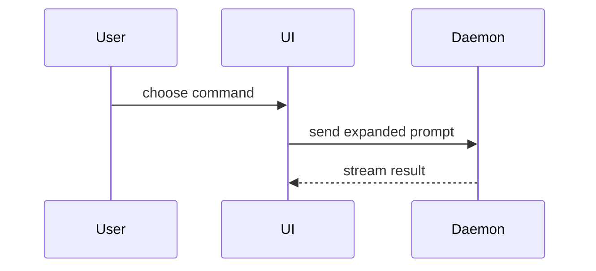

# Show Me

Help the user understand the current topic visually. Skip the preamble and keep prose brief. Pick the smallest view that makes the key point clear.

Use this skill for chat and progress updates. Do not create HTML or SVG files unless the user asks for a diagram file. For a formal diagram file, use the `architecture-diagram` skill instead.

- Show logic or an algorithm as pseudocode:

```text
on(save)
  if content is unchanged
    return cached result
  write new content
  return fresh result
```

- Show runtime control flow as a call tree:

```text
submitForm
  createSession
    persistPrompt
    launchAgent
  navigateToSession
```

- Show UI structure as a component tree, including state and module boundaries that matter:

```tsx
<SessionPage> (apps/example/src/routes/session.tsx)
  useSessionEvents()
  <SessionToolbar>
    <RunSkillButton> (packages/ui)
```

- Show file responsibility or a broad refactor as a shallow file tree:

```text
src/
├── commands/       # parses user actions
├── sessions/       # owns session state
└── transport/      # sends API requests
```

- Show component interaction, control flow, or data flow with Mermaid:



- Use `diff` when the point is what changes and the surrounding shape already exists. Match the diff shape to the topic.

Place each visual next to the short text it supports. Keep only the calls, files, props, states, and boundaries needed to answer the current question. Use one view when one view is enough. Use several only when the question needs them. Do not overwhelm the user.

Preserve code, identifiers, paths, commands, numbers, error messages, and quoted material verbatim.
